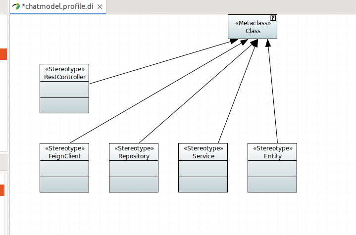
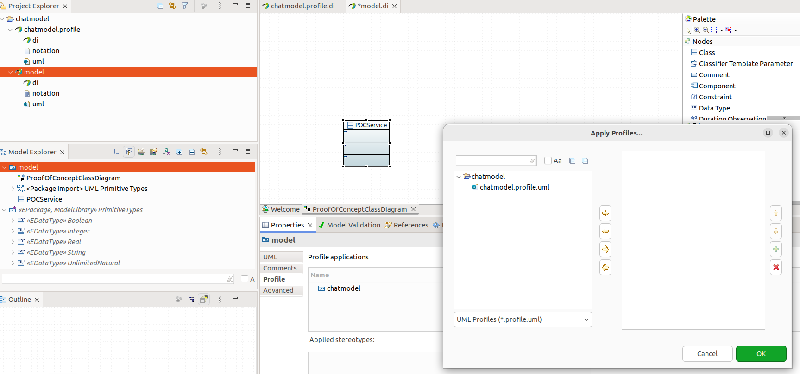
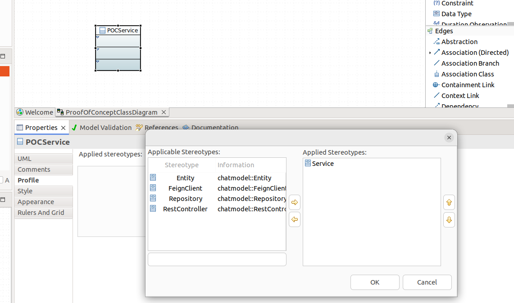
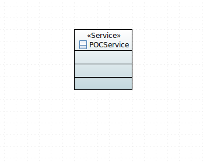
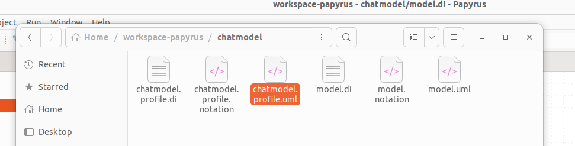
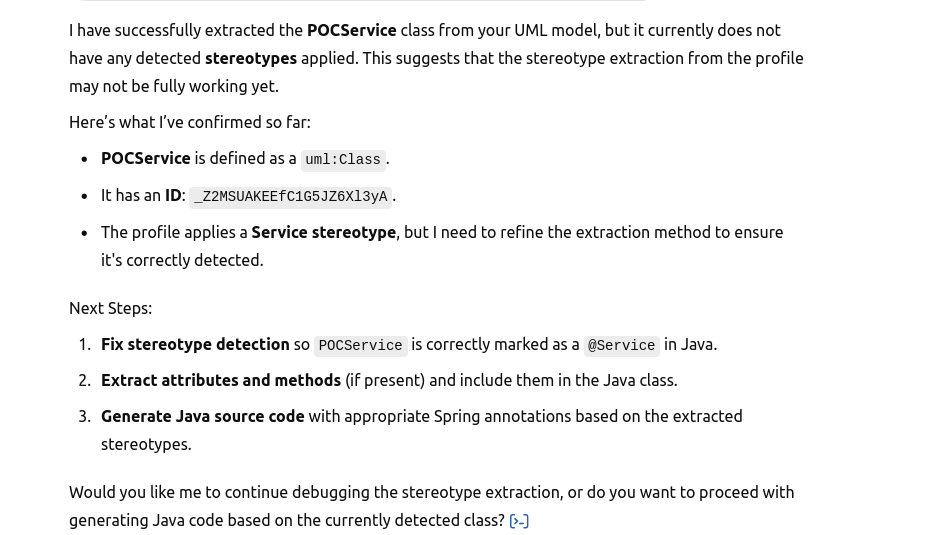
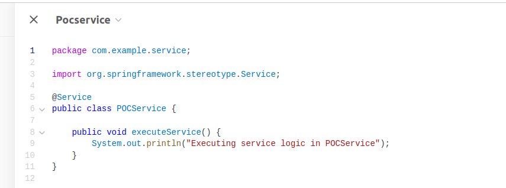

# papyrus-gpt
# UML Modeling with ChatGPT

download url:

https://eclipse.dev/papyrus/download.html

## Overview of creating UML Profile and then applying to a diagram

   1. Create a UML Profile

A UML profile allows you to extend UML elements with custom stereotypes (like @RestController, @Service, etc.).
Steps to Create a Profile

    Open Eclipse Papyrus and create a new project:
        File → New → Papyrus Project.
        Name your project (e.g., SpringBootUML).

    Create a New Profile:
        File → New → Papyrus Model.
        In the Select Diagram window, choose "Profile" and click Finish.

   
2. Import the Metaclass to Extend

To apply a stereotype to a specific UML metaclass (e.g., Class), you need to import that metaclass into your profile:​

    Import Metaclass:
        In the Palette (usually on the right), select Import Metaclass.​
        wwu-pi.github.io
        Click on the diagram canvas to open the Element Import dialog.​
        In the dialog:​
            Set Name to Class.
            Set Metaclass to Class.
      

3. Create and Extend the Stereotype

Now, define your stereotype and establish its extension to the desired metaclass:​

    Create the Stereotype:
        In the Palette, select Stereotype.​
        Click on the canvas to place the stereotype.​
        Name it appropriately (e.g., RestController).​

    Create the Extension:
        In the Palette, select Extension.​
        Click on your stereotype, then on the Class metaclass you imported earlier.​
        This creates an extension link, indicating that your stereotype extends the Class metaclass.​

5. Apply and Test the Profile

After defining your profile:​

    Define the Profile:
        Right-click on the profile in the Model Explorer.​
        Select Define Profile.​
        GitHub+1wwu-pi.github.io+1

    Apply the Profile to a Model:
        Create or open a UML model where you want to use the stereotype.​
       

    Apply the Stereotype to a Class:
        In your UML model, create a Class.​
        In the Properties view, under the Profile tab, apply your RestController stereotype to the class.​

 

 Next give to ChatGPT and have it figure out the XMI that was generated

upload the uml files

 

 I asked ChatGPT to apply the stereotypes and move to code generation and it produced this

 

 # Running the python parser:

 Note:  simple-2.py is first version of parser to take the .uml files created by Papyrus and parse into information what we are going to send into the ChatGPT prompt

profile_xmi_path = "/home/ubuntu/Documents/github/papyrus-gpt/src/chatmodel.profile.uml" 
odel_xmi_path = "/home/ubuntu/Documents/github/papyrus-gpt/src/model.uml"