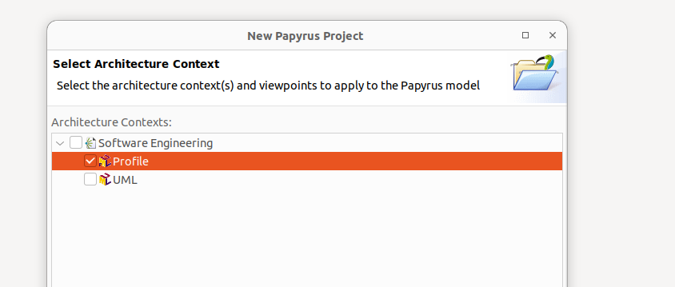

# papyrus-gpt
# UML Modeling with ChatGPT

download url:

https://eclipse.dev/papyrus/download.html

## Overview of creating UML Profile and then applying to a diagram

   1. Create a UML Profile

A UML profile allows you to extend UML elements with custom stereotypes (like @RestController, @Service, etc.).
Steps to Create a Profile

    Open Eclipse Papyrus and create a new project:
        File → New → Papyrus Project.
        Name your project (e.g., SpringBootUML).

    Create a New Profile:
        File → New → Papyrus Model.
        In the Select Diagram window, choose "Profile" and click Finish.

    Define Stereotypes for Spring Boot
        In the model explorer, right-click the profile → New Child → Stereotype.
        Name the stereotype (e.g., RestController).
        Repeat for other stereotypes (Service, FeignClient, Repository, Entity).

    Extend UML Elements
        Click on a stereotype (RestController).
        In Properties → General → Base Class, select Class.
        This means your @RestController stereotype can only be applied to UML Classes.

    Add Tagged Values (Optional)
        Right-click a stereotype → New Child → Property.
        Example:
            FeignClient → Property: baseUrl: String
            Entity → Property: tableName: String

    Save and Export the Profile
        File → Save.
        Right-click the profile model → Define Profile.
        This locks the profile for use in diagrams.

2. Apply the Profile in the Same Project

Once you’ve defined the profile, you can apply it within the same UML project.
Steps:

    Create a Class Diagram:
        File → New → Papyrus Model.
        Select "UML" as the model type.
        Create a Class Diagram (Right-click model → New Diagram → Class Diagram).

    Apply the Profile:
        Go to Model Explorer.
        Right-click your UML Model (not the profile) → Apply Profile....
        Select your SpringBootUMLProfile.

    Use the Profile on UML Classes
        Add UML classes (Class tool from the palette).
        Right-click a class → Properties View.
        Select Applied Stereotypes → Click Apply Stereotype.
        Choose RestController, Service, etc.

3. Example: Applying the Profile

Once applied, you can create a Spring Boot UML model:
Class Name	Stereotype Applied	Tagged Values
UserController	@RestController	N/A
UserService	@Service	N/A
UserRepository	@Repository	N/A
User	@Entity	tableName = "users"
ExternalUserClient	@FeignClient	baseUrl = "http://api.example.com"
